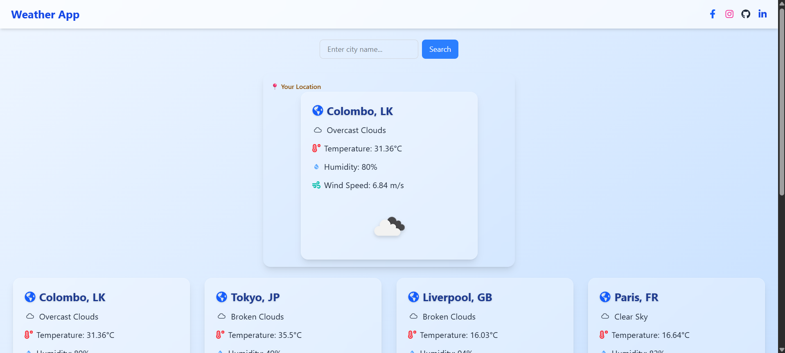

# Weather App 🌦️

A modern, responsive weather application built with **React**, **Tailwind CSS**, and the **OpenWeatherMap API**. This app allows users to check current weather conditions and 5-day forecasts for cities worldwide, including their current location. It features a clean UI with interactive components and smooth navigation.

## Features ✨

- 🌍 **Current Weather**: View real-time weather data for any city or your current location.
- 📅 **5-Day Forecast**: Check detailed weather forecasts with temperature, humidity, and wind speed.
- 🔍 **City Search**: Search for weather conditions by city name.
- 📍 **Geolocation**: Automatically detect and display weather for the user's location.
- 🖼️ **Interactive UI**: Includes a responsive design with Swiper.js for forecast carousels and Tailwind CSS for styling.
- 🚀 **Smooth Navigation**: Built with React Router for seamless page transitions.
- 📱 **Mobile-Friendly**: Fully responsive design for all screen sizes.
- 🔄 **Loading States**: Displays a spinner during data fetching for a better user experience.

## Live Demo 🌐

Check out the live version of the Weather App here: [Weather App](https://weather-app-thilina.netlify.app/)

## Tech Stack 🛠️

- **React**: Frontend library for building the user interface.
- **Tailwind CSS**: Utility-first CSS framework for styling.
- **Swiper.js**: For the forecast carousel with navigation and pagination.
- **React Router**: For client-side routing.
- **OpenWeatherMap API**: Provides weather data for cities and coordinates.
- **React Icons**: For weather-related icons.
- **Vite**: Build tool for fast development and production builds.

## Installation ⚙️

Follow these steps to set up the project locally:

1. **Clone the Repository**:
   ```bash
   git clone https://github.com/IT22003850/weather-app---react.git
   cd weather-app
   ```

2. **Install Dependencies**:
   ```bash
   npm install
   ```

3. **Set Up Environment Variables**:
   Create a `.env` file in the root directory and add your OpenWeatherMap API key:
   ```env
   VITE_WEATHER_API_KEY=your-api-key-here
   ```
   Get your API key from [OpenWeatherMap](https://openweathermap.org/api).

4. **Run the Development Server**:
   ```bash
   npm run dev
   ```
   The app will be available at `http://localhost:5173`.

5. **Build for Production**:
   ```bash
   npm run build
   ```

## Usage 📖

- **Home Page**: View weather for default cities or your current location. Use the search bar to find weather data for any city.
- **City Page**: Click on a city card to view detailed weather information and a 5-day forecast.
- **Navigation**: Use the "Back to Home" button or social media links in the header for navigation.
- **Error Handling**: If a city is not found or the API fails, an error message is displayed.

## Screenshots 📸

Below are screenshots of the Weather App showcasing the **Home page** and **City page**:

### Home Page

*Displays the search bar, user location weather, and default city cards.*

### City Page

*Shows detailed weather information for a selected city and the 5-day forecast carousel.*

## Folder Structure 📁

```
weather-app--react/
├── src/
│   ├── components/
│   │   ├── CityCard.jsx
│   │   ├── Layout.jsx
│   │   └── Spinner.jsx
│   ├── pages/
│   │   ├── City.jsx
│   │   ├── Home.jsx
│   │   └── NotFound.jsx
│   ├── App.jsx
│   ├── App.css
│   └── main.jsx
├── .env
├── index.html
├── package.json
├── vite.config.js
└── README.md
```


## Contact 📬

For questions or feedback, reach out via:

- **Email**: thilinat.dev@gmail.com

Enjoy exploring the weather! ☀️🌧️❄️